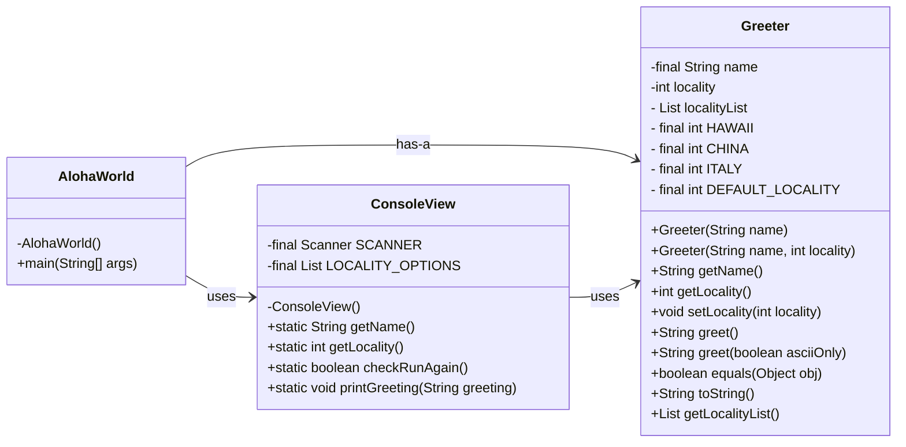

# Homework Aloha World Report

The following report contains questions you need to answer as part of your submission for the homework assignment. 

## Design Doc
Please link your UML design file here. See resources in the assignment on how to
link an image in markdown. You may also use [mermaid] class diagrams if you prefer, if so, include the mermaid code here.  You DO NOT have to include Greeting.java as part of the diagram, just the AlohaWorld application that includes: [AlohaWorld.java], [Greeter.java], and [ConsoleView.java].

### Program Flow
Write a short paragraph detailing the flow of the program in your own words. This is to help you understand / trace the code (and give you practice of something called a code walk that will be required in this course).

> 1. The main() method of the AlohaWorld class starts the program.
> 2. Then ConsoleView class is used to get user input (name and region).
> 3. After that, Greeter class is used to generate a greeting based on the input.
> 4. ConsoleView.printGreeting() prints out the greeting sentence.

## Assignment Questions

1. List three additional java syntax items you didn't know when reading the code.  (make sure to use * for the list items, see example below, the backtick marks are used to write code inline with markdown)
   
   * `final class`
   * `static`
   * `void`

2. For each syntax additional item listed above, explain what it does in your own words and then link a resource where you figured out what it does in the references section. 

    * The `final` keyword when used on a class prevents the class from being subclassed. This means that the class cannot be extended by another class. This is useful when you want to prevent a class from being modified or extended.[^1] The `final` makes the constants variable value immutable. The `final` makes the method cannot be overridden by subclasses. The `final` makes the class cannot be inherited.[^3]
    * The `static` keyword is used to declare class variables and class methods. It makes the variable or method belongs to the class itself, not to an instance of the class. All instances of a class share static variables, and static methods can be called without creating a class instance.[^4]
    * The `void` keyword is used to show the return type of a method, which means that the method has no return value.[^5]

3. What does `main` do in Java? 

    * The `main` is used to start a program. When the program runs, the JVM automatically calls the `main` method.

4. What does `toString()` do in Java? Why should any object class you create have a `toString()` method?

    * The `toString()` is used to returns a string representation of the object. Because it can provide more readable object descriptions to make debugging and logging easier.

5. What is javadoc style commenting? What is it used for? 

    * The javadoc style commenting is used to generate class and method documentation. It's syntax is /** ... */ and can generate HTML-formatted API documentation through the javadoc tool.

6. Describe Test Driving Development (TDD) in your own words. 

    * Test Driving Development (TDD) refers that writing test cases before writing code, and then implementing the code according to the test cases to ensure that the code can pass all tests.   

7. Go to the [Markdown Playground](MarkdownPlayground.md) and add at least 3 different markdown elements you learned about by reading the markdown resources listed in the document. Additionally you need to add a mermaid class diagram (of your choice does not have to follow the assignment. However, if you did use mermaid for the assignment, you can just copy that there). Add the elements into the markdown file, so that the formatting changes are reserved to that file. 

## Deeper Thinking Questions

These questions require deeper thinking of the topic. We don't expect 100% correct answers, but we encourage you to think deeply and come up with a reasonable answer. 

1. Why would we want to keep interaction with the client contained to ConsoleView?

>Seperate the backend logic with the user interaction logic. Just like in a MVC（Model-View-Controller）mode, the controller is responsible for processing user input and business logic. This method can increase the testability, reusability and maintainability of codes.

2. Right now, the application isn't very dynamic in that it can be difficult to add new languages and greetings without modifying the code every time. Just thinking programmatically,  how could you make the application more dynamic? You are free to reference Geeting.java and how that could be used in your design.

>Perhaps we can use an external file to store greetings in different languages ​​and their correspondence. The Greeting.java class can read data from the file and load the greetings. At the same time, a `Map<String, String> `structure is used to store the mapping between languages ​​and greetings. In this way, the greetings can be updated without modifying the code.

> [!IMPORTANT]
>  After you upload the files to your github (ideally you have been committing throughout this progress / after you answer every question) - make sure to look at your completed assignment on github/in the browser! You can make sure images are showing up/formatting is correct, etc. The TAs will actually look at your assignment on github, so it is important that it is formatted correctly.

## References

[^1]: Final keyword in Java: 2024. https://www.geeksforgeeks.org/final-keyword-in-java/. Accessed: 2024-03-30. 

[^2]: Math (Java Platform SE 17). https://docs.oracle.com/en/java/javase/17/docs/api/java.base/java/lang/Math.html. Accessed: 2024-03-30.

[^3]: Java final Keyword. https://www.w3schools.com/java/ref_keyword_final.asp. Accessed: 2025-01-08.

[^4]: Static Keyword in Java. https://www.geeksforgeeks.org/static-keyword-java/. Accessed: 2025-01-08.

[^5]: Java void Keyword. https://www.w3schools.com/java/ref_keyword_void.asp. Accessed: 2025-01-08.

<!-- This is a comment, below this link the links in the document are placed here to make ti easier to read. This is an optional style for markdown, and often as a student you will include the links inline. for example [mermaid](https://mermaid.js.org/intro/syntax-reference.html) -->
[mermaid]: https://mermaid.js.org/intro/syntax-reference.html
[AlohaWorld.java]: src/main/java/student/AlohaWorld.java
[Greeter.java]: src/main/java/student/Greeter.java
[ConsoleView.java]: src/main/java/student/ConsoleView.java